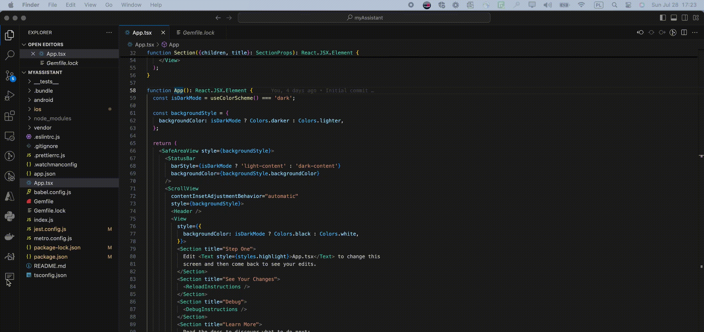

# function-list-side-bar README

Function List Side Bar is a Visual Studio Code extension that adds a function list to the sidebar, helping developers quickly navigate through their code.

## Features

- Displays a list of functions and classes in the sidebar.
- Supports nested functions within methods.
- Highlights the selected function in the editor.



## Installation

1. Open Visual Studio Code.
2. Go to the Extensions view by clicking on the Extensions icon in the Activity Bar on the side of the window or pressing `Ctrl+Shift+X`.
3. Search for `function-list-side-bar`.
4. Click `Install` to install the extension.
5. Reload Visual Studio Code.
6. Go to `View > Appearance > Secondary Side Bar` to enable it, then drag the extension to the sidebar.

## Requirements

No additional requirements.

## Extension Settings

This extension does not contribute any settings.

## Known Issues

- Some nested functions may not be captured correctly.
- Functions defined with `const` or `let` are supported but may have display issues in some cases.

## Release Notes

### 0.0.3

Initial release of Function List Side Bar.

## Development

To contribute to this project, follow these steps:

1. Clone the repository:
    ```sh
    git clone https://github.com/bonifacemwanza/func-navigator.git
    ```

2. Create a new branch:
    ```sh
    git checkout -b feature-branch
    ```

3. Make your changes.

4. Open a Pull Request from your branch to the main branch.

## Author

Developed by Boniface Mwanza. [GitHub Profile](https://github.com/bonifacemwanza)

## License

MIT License. See [LICENSE](LICENSE) for more information.
